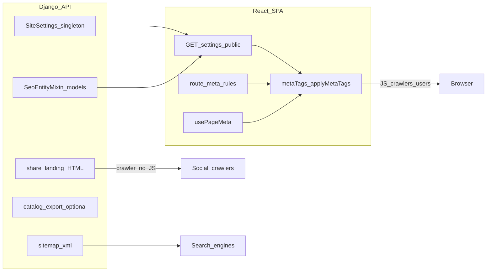

# SEO implementation guide — full-stack (Django API + React SPA)

Portable, **implementation-ready** specification. Profile your product, enable modules from the registry, implement backend then frontend, then run the verification gate (Part L).

**Reference stack:** Django (REST API, sitemap, feeds, share HTML) + React (Vite SPA, client meta pipeline). Other stacks: map concepts in [Appendix D](#appendix-d-adapting-to-other-frameworks).

---

## Part A — Onboarding

### A.1 Copy-paste prompt for AI or contractors

```text
Read SEO_IMPLEMENTATION_GUIDE.md end-to-end.

1. Fill the project profile (A.3) from this codebase’s routes and models.
2. Mark each module in the registry (A.2) as ON or OFF.
3. Implement in order:
   a) Part B config (PUBLIC_SITE_URL, robots.txt, index.html defaults)
   b) Part C models + Part D public API
   c) Part E backend (sitemap; catalog feed if MOD_CATALOG; share landings if MOD_SHARE)
   d) Part F frontend (meta pipeline, route rules, usePageMeta on detail/listing pages)
   e) Part H admin fields
4. Run Part L verification checklist; fix every failure.
5. Report gaps using Part M common faults as a rubric.

Do not ship placeholder index.html meta. Do not use relative Sitemap URLs in robots.txt.
Align og:type on SPA and share HTML for the same entity.
```

### A.2 Module registry

| ID | Module | When to enable | Backend (Django) | Frontend (React) | Verify |
|----|--------|----------------|------------------|------------------|--------|
| **CORE** | Core meta + sitemap + robots | Always | Settings model, `sitemap.xml`, public settings API | `metaTags`, `RouteMetaLoader`, `robots.txt` | Part L rows 1–6 |
| **MOD_SPA** | Client `<head>` updates | SPA without SSR for all routes | N/A | `applyMetaTags`, route + page hooks | Meta changes on navigation |
| **MOD_SHARE** | Social crawler HTML | Users share entity URLs in chat/social | `/{entity}/{slug}/share/` views | Share buttons → share API URL | Slack/FB debugger preview |
| **MOD_JSONLD** | Structured data | Public detail/listing/home pages | Optional fields in API | `jsonLd` in `MetaInput` | Rich Results Test |
| **MOD_FACETS** | Search/filter URL control | Listings with query params or facets | Exclude filtered URLs from sitemap | `noindex` in `usePageMeta` when filters active | Search Console coverage |
| **MOD_CATALOG** | Ads/merchant feeds | Sell/list items on Google/Meta/etc. | CSV/JSON/XML export iterator | N/A (URL in admin docs) | Feed validates in Merchant Center |
| **MOD_CMS** | Editable SEO fields | Non-devs edit content | `meta_title`, `meta_description` on models | Wire API → `usePageMeta` | Override appears in `<title>` |
| **MOD_I18N** | Multilingual SEO | Multiple public locales | Translated meta + hreflang routes | `hreflang` link tags | No conflicting canonical/hreflang |
| **MOD_TRACK** | Analytics pixels | Measurement needed | Script fields on settings | Inject after consent if required | Scripts load only when allowed |
| **MOD_AUTH** | Private areas | Login, dashboard, admin | Exclude from sitemap | `noindex` route rules | `/admin` not in sitemap |

### A.3 Project profile template

Copy and fill before implementation:

```yaml
site_name: "Your Brand"
public_base_url: "https://www.example.com"   # no trailing slash
default_locale: "en"
rendering: "spa"                             # spa | ssr | static

indexable_routes:
  - path: "/"
    sitemap: true
    priority: "1.0"
  - path: "/blog"
    sitemap: true
  - path: "/blog/{slug}"
    entity: "Article"
    sitemap: true
  # Add: /docs/{slug}, /product/{slug}, /page/{slug}, etc.

noindex_routes:
  - "/login*"
  - "/register*"
  - "/account*"
  - "/admin*"
  - "/checkout"
  - "/search"                                 # or index with canonical policy

shareable_entities:                          # MOD_SHARE
  - entity: "Article"
    api_share_path: "/api/blog-posts/{slug}/share/"
    spa_path: "/blog/{slug}"
  # - entity: "Product"
  #   api_share_path: "/api/products/{slug}/share/"
  #   spa_path: "/product/{slug}"

modules:
  MOD_CATALOG: false
  MOD_I18N: false
  MOD_SHARE: true
```

### A.4 Architecture



### A.5 Example profiles (pick closest, then customize)

| Profile | Indexable surfaces | Typical modules ON |
|---------|-------------------|-------------------|
| Marketing + blog | Home, `/blog`, `/blog/{slug}`, `/page/{slug}` | CORE, MOD_SPA, MOD_SHARE, MOD_JSONLD, MOD_CMS |
| Docs site | Home, `/docs`, `/docs/{slug}` | CORE, MOD_JSONLD (`TechArticle`), MOD_FACETS if search |
| Storefront | Home, categories, products, blog, CMS pages | All except MOD_I18N unless multilingual |
| SaaS app | Marketing pages only; app behind auth | CORE, MOD_AUTH; MOD_CATALOG off |

---

## Part B — Configuration (required)

### B.1 `PUBLIC_SITE_URL`

- **Django:** `settings.PUBLIC_SITE_URL` (or `STOREFRONT_PUBLIC_URL`) — no trailing slash.
- **Used for:** sitemap `<loc>`, catalog `link`, share landing canonical target, OG fallbacks in server HTML.
- **React:** `buildCanonicalUrl(path)` uses `window.location.origin` in browser; server-generated URLs must use env, not hardcoded hosts.
- **Staging/production:** separate env files; never emit production URLs from staging builds in sitemap/feeds.

### B.2 `robots.txt`

Serve at site root (`/robots.txt` from static or CDN).

```text
User-agent: *
Allow: /

Sitemap: https://www.example.com/api/meta/sitemap.xml
```

Rules:

- **`Sitemap:` must be absolute** (include scheme + host).
- Do not block CSS/JS required for rendering.
- Optional: explicit `Allow` for `Googlebot`, `Twitterbot`, `facebookexternalhit` if you use a restrictive default.

### B.3 Static HTML shell (`index.html`)

Before JavaScript runs, crawlers and “View Source” see this file.

**Required:**

- `html[lang]` matching primary locale
- `meta charset`, `viewport`
- `<title>`, `meta name="description"`, default OG/Twitter aligned with **real** brand (not “Store” / “Online store”)

**Options for non-placeholder defaults:**

1. Build-time env injection (Vite `define`, `html-transform` plugin)
2. Minimal SSR/prerender for `/`
3. Accept brief generic shell only if **every** indexable route is SSR’d (rare for SPA)

**Fault:** Leaving `/placeholder.svg` and generic “Store” as the only first-paint signal.

---

## Part C — Data model (Django)

### C.1 Site settings (singleton)

| DB field (snake_case) | Purpose |
|----------------------|---------|
| `site_name` | Brand; `og:site_name`, title suffix |
| `site_meta_description` | Default meta description + OG/Twitter fallback |
| `site_logo` | Default OG image fallback |
| `site_favicon` | Favicon URL |
| `cover_image` | Hero / default OG when entity has no image |

Optional (MOD_TRACK): `google_analytics_script`, `facebook_pixel_script`, etc. — not ranking signals.

### C.2 `SeoEntityMixin` (abstract)

Attach to every **public, indexable** model:

| Field | Max / type | Notes |
|-------|------------|-------|
| `meta_title` | CharField 255, blank | Override `<title>` segment |
| `meta_description` | TextField, blank | Override meta description |
| `meta_keywords` | CharField 255, blank, optional | **Storage only**; do not output to `<head>` unless you have a deliberate legacy need |

### C.3 Listable / detail entities

Each type that has a public URL should also have:

- `slug` (unique, stable)
- `updated_at` (sitemap `lastmod`)
- Primary image URL (OG, JSON-LD, feeds)
- Short text: `excerpt`, `summary`, or stripped `description` for fallbacks

### C.4 Entity → URL mapping (configure per project)

| Entity (example) | SPA path pattern | In sitemap? |
|------------------|------------------|-------------|
| `Page` | `/page/{slug}` | If `status=public` |
| `Article` | `/blog/{slug}` | If published |
| `Category` | `/category/{slug}` | If public |
| `Product` | `/product/{slug}` | If active |
| `Job` | `/jobs/{slug}` | If open |

Register each row in the **sitemap provider list** (Part E1).

---

## Part D — Public API contract (Django → React)

### D.1 `GET /api/settings/public/`

| JSON key (camelCase) | Source |
|---------------------|--------|
| `siteName` | `site_name` |
| `siteMetaDescription` | `site_meta_description` |
| `siteLogo` | absolute media URL |
| `siteFavicon` | absolute media URL |
| `coverImage` | absolute media URL |

Call once per session (cache ~2 min). On load: `configureSiteSeo({ siteName, siteMetaDescription, defaultOgImage: coverImage || siteLogo })`.

### D.2 Detail endpoints

Each public entity endpoint includes at minimum:

```json
{
  "slug": "my-item",
  "metaTitle": "",
  "metaDescription": "",
  "title": "Display name",
  "excerpt": "…",
  "featuredImage": "https://…"
}
```

### D.3 Fallback resolution (shared backend + frontend)

| Output | Order |
|--------|-------|
| Title segment | `metaTitle` → display `title` / `name` |
| Meta description | `metaDescription` → excerpt → stripped body (cap **160–180** chars for `<meta>`) |
| JSON-LD description | same sources, cap ~5000 chars |
| OG image | entity image → `coverImage` → `siteLogo` |

Strip HTML tags from rich text before meta/JSON-LD.

---

## Part E — Backend SEO services (Django)

Suggested layout:

```text
core/
  seo/
    sitemap.py          # providers + build_xml
    catalog.py          # MOD_CATALOG iterator
    share.py            # MOD_SHARE HTML helpers
  views/
    meta_views.py       # sitemap, catalog, share endpoints
```

### E1 — Dynamic XML sitemap

**Route:** `GET /api/meta/sitemap.xml`  
**Response:** `Content-Type: application/xml; charset=utf-8`

#### Provider pattern

```python
# Pseudocode — register providers in settings or seo/sitemap.py
SITEMAP_PROVIDERS = [
    "seo.providers.static_pages",      # home, contact, …
    "seo.providers.blog_posts",
    "seo.providers.cms_pages",
    # "seo.providers.products",
]

def iter_sitemap_entries():
    for provider_path in SITEMAP_PROVIDERS:
        yield from import_string(provider_path).entries()
```

Each provider yields dicts:

```python
{
    "loc": f"{PUBLIC_SITE_URL}/blog/{post.slug}",
    "lastmod": post.updated_at.date().isoformat(),  # optional
    "changefreq": "weekly",   # optional hint
    "priority": "0.8",        # optional hint
}
```

#### Inclusion rules

| Include | Exclude |
|---------|---------|
| URLs with `index,follow` policy | Auth, admin, cart, checkout |
| Stable marketing routes you want indexed | Internal search result URLs |
| Published/active entities only | Filtered listing states (if MOD_FACETS policy says noindex) |

#### XML builder

```python
def sitemap_entry(loc, lastmod="", changefreq="daily", priority="0.7"):
    parts = [f"<loc>{escape(loc)}</loc>"]
    if lastmod:
        parts.append(f"<lastmod>{escape(lastmod)}</lastmod>")
    parts.append(f"<changefreq>{escape(changefreq)}</changefreq>")
    parts.append(f"<priority>{escape(priority)}</priority>")
    return "<url>" + "".join(parts) + "</url>"
```

Wrap: `<?xml …><urlset xmlns="http://www.sitemaps.org/schemas/sitemap/0.9">…</urlset>`.

#### Adding a new entity type

1. Add `SeoEntityMixin` + slug + `updated_at` on model.
2. Create provider querying `status=True` (or equivalent).
3. Register provider in `SITEMAP_PROVIDERS`.
4. Add React route + `usePageMeta` (Part F).
5. Add row to project profile `indexable_routes`.

### E2 — Catalog / ads export (MOD_CATALOG)

**Routes (convention):**

| Path | Format |
|------|--------|
| `/api/meta/catalog-export.csv` | CSV |
| `/api/meta/catalog-export.json` | JSON |
| `/api/meta/catalog-export.xml` | RSS 2.0 / Google-style XML |

**Iterator:** one row per listable item; plain-text description (strip HTML); **absolute** `link` and `image_link`.

**Typical row fields:**

| Field | Notes |
|-------|-------|
| `id` | Stable platform id |
| `title` | Display name |
| `description` | From `meta_description` or body, capped |
| `link` | `{PUBLIC_SITE_URL}/product/{slug}` (or your pattern) |
| `image_link` | Primary image absolute URL |
| `availability` | in stock / out of stock |
| `price` | Amount + currency if applicable |
| `brand`, `category` | Optional |
| `sale_price` | When discounted |

See [Appendix B](#appendix-b-catalog-field-mapping) for platform differences.

### E3 — Share landing HTML (MOD_SHARE)

**Route pattern:** `GET /api/{collection}/{slug}/share/`  
**Purpose:** Return HTML with full meta for crawlers that do not run your SPA; redirect humans to SPA.

**Required head content:**

| Element | Rule |
|---------|------|
| `<title>` | Resolved title (escaped) |
| `meta name="description"` | Resolved description (escaped) |
| `link rel="canonical"` | **SPA URL** (`{PUBLIC_SITE_URL}/blog/{slug}`), not share URL |
| `og:title`, `og:description`, `og:url` | `og:url` may be share URL or canonical—pick one policy; document it |
| `og:type` | **Must match SPA** (`article`, `product`, or `website`) |
| `og:image`, `og:image:secure_url` | When HTTPS image exists |
| `twitter:card` | `summary_large_image` |
| `twitter:title`, `twitter:description`, `twitter:image` | Mirror OG |
| Redirect | `<meta http-equiv="refresh" content="0;url={spa_url}">` + fallback `<a>` |

**Image fallback chain:** entity image → `site_logo` → `cover_image`.

**Frontend:** share buttons for Facebook/LinkedIn should point at **share API URL**; in-app copy-link can use SPA URL.

### E4 — Backend tests (minimum)

| Test | Assert |
|------|--------|
| `test_sitemap_xml_200` | 200, `application/xml`, contains known slug |
| `test_sitemap_loc_absolute` | Every `<loc>` starts with `PUBLIC_SITE_URL` |
| `test_share_landing_og_title` | Share HTML contains `og:title` and canonical SPA URL |
| `test_catalog_export_row` | MOD_CATALOG: CSV/JSON has required columns for one fixture item |

---

## Part F — Frontend meta pipeline (React)

Suggested layout:

```text
src/lib/seo/
  metaTags.ts       # types, configureSiteSeo, applyMetaTags, buildCanonicalUrl
  routeMeta.ts      # path → default MetaInput
src/components/seo/
  RouteMetaLoader.tsx   # on navigation
  # usePageMeta exported from same file or hook file
```

Mount `<RouteMetaLoader />` once inside the router (e.g. next to `<Routes>`).

### F.1 `MetaInput` type

```typescript
export type MetaInput = {
  title?: string;
  description?: string;
  canonicalUrl?: string;
  robots?: string;
  ogType?: "website" | "article" | "product" | "profile";
  ogTitle?: string;
  ogDescription?: string;
  ogImage?: string;
  ogUrl?: string;
  twitterCard?: "summary" | "summary_large_image";
  twitterTitle?: string;
  twitterDescription?: string;
  twitterImage?: string;
  jsonLd?: Record<string, unknown> | Array<Record<string, unknown>>;
};
```

### F.2 `applyMetaTags` behavior

On each call:

1. Merge with site defaults (`configureSiteSeo` from public settings).
2. Resolve **absolute** canonical and `og:url` via `buildCanonicalUrl(path)`.
3. Title: `withSuffix(title)` → `"Page | Brand"` unless title empty or equals brand.
4. Default `robots`: `index,follow`.
5. Default `twitter:card`: `summary_large_image`.
6. Set `document.title`, `<link rel="canonical">`, meta tags (use a marker attribute to find/update managed tags).
7. JSON-LD: single `<script type="application/ld+json" id="…">`; wrap arrays as `{ "@context": "https://schema.org", "@graph": [...] }`.
8. `applyFaviconHref` from settings when present.

**When `og:image` is HTTPS, also set `og:image:secure_url`** (parity with share HTML).

### F.3 Three layers

| Layer | When | Responsibility |
|-------|------|----------------|
| **RouteMetaLoader** | Every `pathname` change | `getRouteMeta(pathname)` + `canonicalUrl` / `ogUrl` from pathname |
| **routeMeta.ts** | Static rules | Default title/description/robots/`ogType` by prefix |
| **usePageMeta(meta)** | Entity data loaded | Override with API `metaTitle`, images, JSON-LD |

**Precedence:**

| Field | Order (first wins) |
|-------|-------------------|
| title | `usePageMeta` → route default → `siteName` |
| description | page → route → `siteMetaDescription` |
| robots | page → route → `index,follow` |
| og:image | page → `coverImage` → `siteLogo` |
| canonical / og:url | page path → `buildCanonicalUrl(pathname)` |

### F.4 Absolute URLs for JSON-LD

```typescript
function toAbsoluteUrl(pathOrUrl: string): string {
  const t = (pathOrUrl || "").trim();
  if (!t) return "";
  if (/^https?:\/\//i.test(t)) return t;
  return new URL(t.startsWith("/") ? t : `/${t}`, window.location.origin).toString();
}
```

Apply to all `BreadcrumbList` `item` values and `ItemList` `url` fields. **Fault:** relative `/product/foo` in JSON-LD.

### F.5 JSON-LD by surface (MOD_JSONLD)

| Surface | Types |
|---------|-------|
| Home | `Organization`, `WebSite`; add `SearchAction` if `/search?q=` works |
| Article detail | `Article`, `BreadcrumbList` |
| CMS page | `WebPage`, `BreadcrumbList` |
| Listing (indexed) | `CollectionPage`, optional `ItemList` (≤24 items, absolute URLs) |
| Sellable detail | `Product`, `Offer`, `BreadcrumbList`; `AggregateRating` only with real reviews |
| FAQ visible on page | `FAQPage` (Q&A must appear in DOM on that URL) |

### F.6 Listing pages (MOD_FACETS)

React Router `pathname` **excludes query string**. In listing components, detect:

- `search` query present → `robots: noindex,follow`, canonical `/search` (or your policy)
- Facets active (price, tags, sort) → `noindex,follow`, canonical to **unfiltered** base path

Pick **one** policy for filtered category URLs (canonical-only vs noindex) and document in project profile.

### F.7 `og:type` alignment

| Content | SPA `ogType` | Share HTML `og:type` |
|---------|--------------|----------------------|
| Blog post | `article` | `article` |
| Sellable detail | `product` | `product` |
| Generic page | `website` | `website` |

**Fault:** SPA uses `product` but share HTML uses `website`.

---

## Part G — Route policy templates

### G.1 Blank template

| Path pattern | robots | Notes |
|--------------|--------|-------|
| `/` | index,follow | |
| | | |
| `/login*` | noindex,follow | |
| `/admin*` | noindex,nofollow | |

### G.2 Example — content + storefront

| Path pattern | robots |
|--------------|--------|
| `/`, `/blog`, `/blog/*`, `/page/*`, `/product/*`, `/category/*` | index,follow |
| `/search` | noindex,follow |
| `/cart`, `/checkout` | noindex,follow |
| `/login*`, `/register*`, `/account*` | noindex,follow |
| `/admin*` | noindex,nofollow |

Implement prefix rules in `routeMeta.ts`; **override** search/facet `noindex` in `usePageMeta` on listing pages.

---

## Part H — Admin / CMS (MOD_CMS)

### H.1 Settings screen

- Site name (if not env-only)
- Default meta description (help: “Used on home and as fallback”)
- Default OG image (cover / logo)
- Favicon upload
- MOD_TRACK: analytics script textareas with security warning

### H.2 Per-entity forms

- Meta title (optional)
- Meta description (textarea)
- Meta keywords (optional, label: “Low impact on search; optional”)

### H.3 Editor validation hints

| Field | Guidance |
|-------|----------|
| Meta title | ~50–60 chars displayed; avoid empty on important pages |
| Meta description | ~150–160 chars |
| Missing image | Warn when entity has no image and site default OG missing |

### H.4 Wire CMS to listings

If taxonomy/listing models have `meta_title` / `meta_description`, pass them into `usePageMeta` on category/listing routes—not only on detail pages.

---

## Part I — Social sharing (MOD_SHARE)

| Concern | Recommendation |
|---------|----------------|
| Share button URL | API share endpoint for FB, LinkedIn, etc. |
| User copies link | SPA canonical URL |
| Image size | ≥ 1200×630 where possible; absolute HTTPS |
| Canonical on share HTML | Points to SPA resource URL |
| Consistency | Same title/description logic as `applyMetaTags` |

**Manual QA:** paste share URL into Slack, iMessage, or Meta Sharing Debugger.

---

## Part J — Internationalization (MOD_I18N)

- Public routes per locale: `/en/blog/...`, `?lang=`, or subdomain—pick one.
- `<link rel="alternate" hreflang="…" href="…">` for each variant.
- Translated `metaTitle` / `metaDescription` per locale.
- Canonical + hreflang must not contradict (each locale page canonicalizes to itself or your chosen cluster policy).

Skip entire part if `default_locale` only.

---

## Part K — Privacy and analytics (MOD_TRACK)

- Load GA4, Clarity, Meta Pixel **after consent** when legally required.
- Do not block rendering on script load.
- Exclude `/admin` from injection if staff should not pollute analytics.

SEO meta tags are independent of pixels.

---

## Part L — Verification gate (“100%” checklist)

Score each **indexable route type** (home, listing, detail, CMS). All CORE items must pass before launch.

### L.1 Core

- [ ] `curl` or View Source: `index.html` has real brand title/description (not placeholders)
- [ ] Every indexable route type: unique `<title>` and `meta description`
- [ ] `link rel="canonical"` is absolute and stable (no accidental query params)
- [ ] `robots.txt` exists; `Sitemap:` is **absolute**
- [ ] `GET /api/meta/sitemap.xml` returns 200; only intended URLs; all `<loc>` absolute
- [ ] Auth, admin, checkout (if any) are `noindex` and **absent** from sitemap
- [ ] `PUBLIC_SITE_URL` correct in production env

### L.2 Modules (if enabled)

- [ ] **MOD_SPA:** navigating routes updates title + canonical without full reload
- [ ] **MOD_SHARE:** share URL preview shows image + title; canonical targets SPA
- [ ] **MOD_JSONLD:** Rich Results Test passes per type; no fake ratings
- [ ] **MOD_FACETS:** filtered/search URLs `noindex` per policy
- [ ] **MOD_CATALOG:** sample row validates in target merchant tool
- [ ] **MOD_CMS:** editing meta title in admin changes rendered `<title>` after save
- [ ] **MOD_I18N:** hreflang pairs validated

### L.3 Automated

- [ ] Backend tests (Part E4) pass in CI

### L.4 Search Console (post-deploy)

- [ ] Sitemap submitted
- [ ] Coverage report matches indexation policy (no surprise indexed `/search?` URLs)

---

## Part M — Common faults (do not ship)

| Fault | Fix |
|-------|-----|
| Placeholder `index.html` (“Store”, `/placeholder.svg`) | Build-time brand injection or SSR |
| Relative `Sitemap:` in `robots.txt` | Use `{PUBLIC_SITE_URL}/api/meta/sitemap.xml` |
| Share `og:type` ≠ SPA `og:type` | Align per Part F.7 |
| CMS meta on model but not on listing page | Wire category/listing `usePageMeta` |
| `meta_keywords` in DB, never used | Omit from `<head>`; document as internal-only |
| Relative URLs in JSON-LD | `toAbsoluteUrl()` everywhere |
| Public marketing route missing from sitemap | Register static provider |
| Sitemap includes `noindex` URLs | Filter providers by robots policy |
| Only SPA URL shared to Facebook | Use share API URL for social buttons |
| `og:image` relative in client meta | Resolve to absolute before `setAttribute` |
| Entity deleted but still in sitemap | Filter `is_active` / `published` in providers |

---

## Appendix A — API route conventions

| Purpose | Method | Path pattern |
|---------|--------|--------------|
| Public settings | GET | `/api/settings/public/` |
| Sitemap | GET | `/api/meta/sitemap.xml` |
| Catalog CSV | GET | `/api/meta/catalog-export.csv` |
| Catalog JSON | GET | `/api/meta/catalog-export.json` |
| Catalog XML | GET | `/api/meta/catalog-export.xml` |
| Share landing | GET | `/api/{entities}/{slug}/share/` |

Prefix `/api` may differ; keep meta routes grouped under `/meta/`.

---

## Appendix B — Catalog field mapping

| Internal | Google Merchant | Meta catalog |
|----------|-----------------|--------------|
| `id` | `id` | `id` |
| `title` | `title` | `title` |
| `description` | `description` | `description` |
| `link` | `link` | `link` |
| `image_link` | `image_link` | `image_link` |
| `availability` | `availability` | `availability` |
| `price` + currency | `price` | `price` |

Consult current platform docs when adding columns.

---

## Appendix C — Field naming (DB ↔ JSON)

| Django model | API JSON |
|--------------|----------|
| `site_name` | `siteName` |
| `site_meta_description` | `siteMetaDescription` |
| `meta_title` | `metaTitle` |
| `meta_description` | `metaDescription` |
| `meta_keywords` | `metaKeywords` |

---

## Appendix D — Adapting to other frameworks

| This guide | Next.js App Router | Nuxt 3 | Laravel |
|------------|-------------------|--------|---------|
| `applyMetaTags` | `generateMetadata()` / `metadata` export | `useSeoMeta()` | Blade `@section('meta')` |
| `RouteMetaLoader` | layout `metadata` + dynamic segments | `definePageMeta` | route middleware sharing meta |
| `PUBLIC_SITE_URL` | `process.env.NEXT_PUBLIC_SITE_URL` | `runtimeConfig.public.siteUrl` | `config('app.url')` |
| Sitemap | `app/sitemap.ts` or Django API | server route or Django API | `spatie/laravel-sitemap` |
| Share HTML | API route or `opengraph-image` | server route | dedicated controller |

**Contract to preserve:** absolute canonical, correct robots per URL family, honest JSON-LD, sitemap ⊆ indexable URLs, share previews for social crawlers.

---

## Document map

| Part | Topic |
|------|-------|
| A | Onboarding, registry, profile, architecture |
| B | Config, robots, index.html |
| C | Django models |
| D | Public API contract |
| E | Sitemap, catalog, share, tests |
| F | React meta pipeline |
| G | Route robots templates |
| H | Admin/CMS |
| I | Social sharing |
| J | i18n |
| K | Analytics/consent |
| L | Verification checklist |
| M | Common faults |
| Appendix | Routes, catalog, naming, other frameworks |
